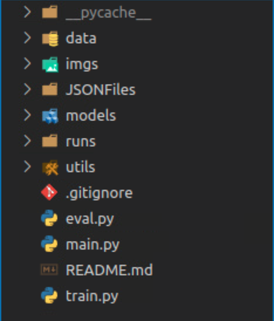

# Este es un modelo que predice la retinopatia diabetica en las 5 fases

## Esta es la forma de como se debe ver el entorno



- # Transformacion de data **_txt2json_**

### Las clases seran guardadas en un **_json_** con el siguiente formato.

```
{
    filenames: [],
    labels: []
}
```

### El nombre de estos JSON estan en el formato por ejemplo 'DDR_train.json'.

### Para poder generarlos se debe correr el **_main.py_** con los siguientes argumentos:

```
python3.8 main.py
--txt2json
--txt /home/bringascastle/Documentos/datasets-retina/DDR-dataset/DR_grading/valid.txt
--path_src /home/bringascastle/Documentos/datasets-retina/DDR-dataset/DR_grading/valid
--save_json ./JSONFiles/DDR --set valid
```

### **_--txt2json_** este aclara que se convertira el json

### Donde **_--txt_** es la ruta del txt con la imagen y la label.

### El txt debe tener el siguiente formato

```
nombredelaimagen etiqueta
Ejemplo:
imagen1.png 0
imagen2.png 1
.
.
.
```

### **_--path_src_** aqui esta la ruta de las imagenes y siempre la ruta va al final sin el '/'

### **_--save_json_** es la ruta donde se va guargar el formato debe ser **_./JSONFiles/{dataset}_** donde dataset se puede poner como en el ejemplo de arriba.

### **_--set_** se define si es **valid** ó **test** ó **train**

- # Entrenamiento desde pesos de IMAGENET

### Para entrenar se utiliza el siguiente comando

```
python3.8 main.py
--train --json_result ./runs/ddr_imagenet_convnext/result_convnext.json
--dump ./runs/ddr_imagenet_convnext/DDR_convnext.pth --dataloader_json ./JSONFiles/DDR_
--model convnext
--device 0
--batch 8
--workers 8
--epochs 100
--lr 0.00002
--decay_lr 0.1
```

### Este comando tien varios muy claros como el de los hiperparametros.

### **_--json_result_** se creara un archivo que guardara perdida y predicciones realizadas(esto ultimo no esta todavia implementado) y se debe especificar que en ./runs/{nombre_quequiera_darle_a_la_carpeta} aunque se reanude se debe especificar esto.

### **_--dump_** es la ruta donde el modelo se va a guardar el modelo junto a su nombre

### **_--dataloader_json_** este da la ruta de los json con los datos para entrenar, evaluar, etc. termininando con la base de datos que tenemos por ejemplo **_'./JSONFiles/DDR\_'_**

### **_--model_** siempre el parametro debe ser convnext para que no haya problema

### Los demas parametros los puede deducir facilmente XD
